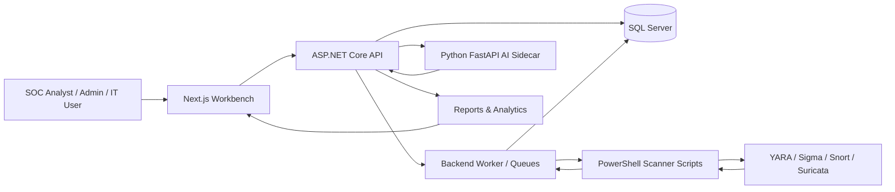

# IOC Manager 🛡️

<p align="center">
  <strong>A unified cyber operations platform for IoC management, scanner orchestration, alert review, reporting, and AI-assisted analyst decisions.</strong>
</p>

<p align="center">
  <a href="https://github.com/SultanEid/IoCManager/actions/workflows/validation.yml">
    
  </a>
  
  
  
  
  
  
</p>

---

## ✨ What Is IOC Manager?

**IOC Manager** is a proof-of-concept cyber operations platform that brings fragmented indicator, scanner, alert, and reporting workflows into one coordinated workbench.

Instead of forcing analysts to jump between scanner dashboards, manual rule files, exported logs, and disconnected reports, IOC Manager connects the operational flow:

> **Indicators → Rules → Targets → Scans → Findings → Alerts → Reports → Analyst Decisions**

The system is built as a multi-component application:

- ⚙️ **ASP.NET Core backend** for APIs, authentication, persistence, jobs, scanner orchestration, and business workflows.
- 🖥️ **Next.js operator workbench** for dashboards, alerts, scan planning, rules, reporting, settings, and AI-assisted workflows.
- 🧠 **Python FastAPI AI sidecar** for explainable decision support, report extraction, scan-plan assistance, and evaluation utilities.
- 🗄️ **SQL Server persistence** for operational entities, scan jobs, alerts, reports, decisions, users, rules, and audit-related records.
- 🧰 **PowerShell scanner scripts** for controlled YARA, Sigma, Snort, Suricata, and network discovery operations in a Windows lab environment.

---

## 📸 Product Preview

Screenshots will be added under `Workspace/Project/docs/assets/readme/`. The README is already structured for a polished product gallery once final images are captured.

| Area | Screenshot Slot | What To Capture |
| --- | --- | --- |
| 🧭 Command dashboard | `Workspace/Project/docs/assets/readme/overview.png` | Security posture, active alerts, detections, reports, and recent activity. |
| 🚨 Alert queue | `Workspace/Project/docs/assets/readme/alerts.png` | Alert filtering, severity/status chips, owner/progress fields. |
| 🛰️ Scanner workflow | `Workspace/Project/docs/assets/readme/scans.png` | Scan plans, scanner jobs, target selection, and execution status. |
| 📦 Rule management | `Workspace/Project/docs/assets/readme/rules.png` | Rule repository, validation, review, rollout, or rollback screens. |
| 🤖 Zira assistant | `Workspace/Project/docs/assets/readme/zira.png` | Scan-planning assistant workflow. |
| 🛡️ Aegis assistant | `Workspace/Project/docs/assets/readme/aegis.png` | Mitigation-planning assistant workflow from report evidence. |
| 📊 Reporting | `Workspace/Project/docs/assets/readme/reporting.png` | Report builder, report archive, or Power BI analytics panel. |

---

## 🚀 Core Capabilities

### 🧩 Centralized IoC Operations

- Manage indicators, scanner findings, targets, reports, and alert context through one application surface.
- Preserve relationships between scanner results, affected targets, rules, jobs, reports, and analyst review.
- Keep operational data searchable and traceable through the backend and SQL Server persistence layer.

### 🛠️ Scanner And Rule Workflows

- Support scanner-oriented workflows for **YARA**, **Sigma**, **Snort**, and **Suricata**.
- Normalize scanner output into a consistent internal result format.
- Queue long-running scan, discovery, and rule-distribution work outside direct frontend requests.
- Track scanner jobs, execution state, diagnostics, and result ingestion.

<p align="center">
  
  
  
  
</p>

| Scanner Path | What IOC Manager Supports | Operational Value |
| --- | --- | --- |
| 🧬 **YARA** | Host/file-oriented rule execution and normalized result capture. | Helps analysts review file and malware-pattern detections from the same workbench as network findings. |
| Σ **Sigma** | Rule metadata, severity context, and event-style payload normalization. | Keeps SIEM-style detections connected to scan jobs, rules, and alert review. |
| 🐷 **Snort** | IDS rule execution output, envelope parsing, and scanner-family normalization. | Brings network IDS findings into the same result ingestion pipeline. |
| 🐾 **Suricata** | IDS/NSM result handling with shared parser and normalizer flow. | Supports multi-engine network detection review without separate dashboards. |
| 🧭 **Network Sweep** | PowerShell-driven discovery of reachable hosts and target inventory updates. | Gives operators a practical way to maintain scan targets in the lab environment. |
| 📦 **Rule Distribution** | Queued distribution jobs, retry handling, and execution tracking. | Reduces manual rule copying and preserves traceability across targets and scanners. |

### 🧭 Operator Workbench

- Provide a web-based SOC-style interface for dashboard review, alerts, scans, rules, reports, servers, and settings.
- Use role-aware UI behavior for Admin, IT, and Cyber Analyst workflows.
- Support both live ASP.NET backend integration and deterministic frontend mock scenarios for development/testing.

### 🤖 AI-Assisted Analyst Support

- Provide explainable, human-governed decision support through a separate Python sidecar.
- Score cases using deterministic features, calibration, uncertainty, evidence signals, and policy constraints.
- Support:
  - **Zira** for scan-planning assistance.
  - **Aegis** for mitigation-plan recommendations from report evidence.
- Keep final action authority with the analyst. IOC Manager is **not** an autonomous threat-response engine.

### ✅ Validation And CI

- GitHub Actions validation pipeline for pull requests and branch updates.
- Backend restore, build, and test checks.
- Frontend linting, type checking, and scope validation.
- AI sidecar pytest suite.
- Repository boundary checks and secret-pattern scanning.

---

## 🏗️ Architecture



---

## 🧱 Tech Stack

| Layer | Technology |
| --- | --- |
| Backend API | ASP.NET Core 8, C#, Controllers, Hosted Services |
| Application Logic | C# services, background queues, scanner dispatchers |
| Persistence | Entity Framework Core, SQL Server |
| Frontend | Next.js 16, React 19, TypeScript, Tailwind CSS |
| UI System | shadcn-style components, Radix/Base UI patterns, Lucide icons |
| Data Fetching | TanStack Query, typed gateway abstraction |
| AI Sidecar | Python 3.11, FastAPI, Pydantic, NumPy, pandas, scikit-learn |
| Testing | xUnit, pytest, ESLint, TypeScript checks, Playwright support |
| Automation | GitHub Actions, PowerShell validation scripts |
| Scanner Scripts | PowerShell workflows for YARA, Sigma, Snort, Suricata, and discovery |

---

## 📁 Repository Structure

```text
IOC_Manager/
├── .github/workflows/
│   └── validation.yml              # CI validation pipeline
├── Workspace/
│   ├── Project/
│   │   ├── backend/                # ASP.NET Core API, Worker, Domain, Infrastructure, Tests
│   │   ├── frontend/workbench/     # Next.js operator workbench
│   │   ├── ai/service/             # Python FastAPI AI sidecar
│   │   ├── docs/                   # Active technical documentation
│   │   ├── deploy/                 # Deployment notes
│   │   └── scripts/                # Project validation/support scripts
│   ├── scripts/                    # Scanner and discovery scripts used by the app
│   └── docs/                       # Scanner contracts and design notes
├── README.md
└── LICENSE
```

The canonical active product root is:

```text
Workspace/Project/
```

Generated outputs, scanner result folders, local logs, temporary directories, and historical/reference material are intentionally outside the active product boundary.

---

## ⚡ Quick Start

### 1. Clone The Repository

```powershell
git clone https://github.com/SultanEid/IoCManager.git
cd IoCManager
```

### 2. Start The Backend

```powershell
Push-Location Workspace/Project/backend
dotnet restore Backend.sln -p:MSBuildEnableWorkloadResolver=false /m:1
dotnet build Backend.sln -c Debug --no-restore -p:MSBuildEnableWorkloadResolver=false /m:1
dotnet run --project src/Backend.Api --no-build --no-restore
Pop-Location
```

Backend notes:

- SQL Server is required for full startup/readiness.
- Development defaults use SQL Server LocalDB unless overridden.
- Copy `.env.example` to `.env` when local configuration is needed.
- See [`Workspace/Project/backend/README.md`](Workspace/Project/backend/README.md) for backend-specific setup.

### 3. Start The Frontend Workbench

```powershell
Push-Location Workspace/Project/frontend/workbench
npm ci
npm run dev
Pop-Location
```

Optional frontend environment:

```env
NEXT_PUBLIC_API_BASE_URL=https://localhost:7244
NEXT_PUBLIC_USE_ASPNET_GATEWAY=0
```

Use `NEXT_PUBLIC_USE_ASPNET_GATEWAY=1` when connecting the workbench to the live ASP.NET backend instead of the deterministic mock provider.

### 4. Start The AI Sidecar

```powershell
Push-Location Workspace/Project/ai/service
.\.venv\Scripts\python.exe -m pip install -e ".[dev]" -c requirements.lock.txt
.\.venv\Scripts\python.exe -m uvicorn decision_service.main:app --host 127.0.0.1 --port 8100
Pop-Location
```

Sidecar health endpoints:

- `GET /livez`
- `GET /readyz`
- `GET /health`
- `GET /metrics`

See [`Workspace/Project/ai/service/README.md`](Workspace/Project/ai/service/README.md) for model, evaluation, and operator workflow details.

---

## 🧪 Validation

### Full GitHub Actions Lane

The repository includes a GitHub Actions workflow at:

```text
.github/workflows/validation.yml
```

It validates:

- Repository boundary policy.
- Secret-pattern scanning.
- Backend restore/build/tests.
- Frontend install, scope check, lint, and type check.
- AI sidecar install and pytest suite.

### Local Backend Checks

```powershell
Push-Location Workspace/Project/backend
dotnet restore Backend.sln -p:MSBuildEnableWorkloadResolver=false /m:1
dotnet build Backend.sln -c Debug --no-restore -p:MSBuildEnableWorkloadResolver=false /m:1
dotnet test tests/Backend.Tests/Backend.Tests.csproj -c Debug --no-build -p:MSBuildEnableWorkloadResolver=false
Pop-Location
```

### Local Frontend Checks

```powershell
Push-Location Workspace/Project/frontend/workbench
npm run scope:check
npm run lint
npm run typecheck
Pop-Location
```

### Local AI Sidecar Checks

```powershell
Push-Location Workspace/Project/ai/service
.\.venv\Scripts\python.exe -m pytest
Pop-Location
```

---

## 🔐 Security And Safety Model

IOC Manager is designed as a **human-governed cyber operations platform**.

- AI outputs are decision support, not automatic enforcement.
- Action plans remain manual-only.
- The sidecar may abstain when confidence or evidence is insufficient.
- Runtime guardrails bound expensive AI requests.
- Secret-pattern scanning is included in CI.
- Repository boundary checks reduce accidental dependency on generated or archived material.
- Production deployment requires hardening for authentication, scanner execution boundaries, secrets, database ownership, request limits, and network access.

---

## 🧠 AI Decision Support

The AI sidecar currently uses a deterministic baseline scoring approach, not a deep neural network.

It combines:

- IoC and case context.
- Host criticality and exposure.
- Scanner agreement.
- Rule severity.
- Source trust.
- Historical-learning context.
- Evidence conflict and uncertainty signals.
- Calibration and promotion-gate metadata.

The goal is to help analysts understand:

- Why a case appears suspicious.
- What evidence is missing.
- Whether confidence is strong enough to recommend next actions.
- When the system should abstain instead of overclaiming.

---

## 🧭 Product Modules

| Module | Purpose |
| --- | --- |
| 🏠 Overview | Command dashboard for posture, activity, detections, reports, and next actions. |
| 🚨 Alerts | Queue and detail workflows for detection review and ownership. |
| 🛰️ Scans | Scan execution, scan history, and scanner result workflows. |
| 🧾 Scan Plans | Target/rule selection and scheduled/manual scan orchestration. |
| 📦 Rules | Rule repository, validation, review, rollout, and rollback workflows. |
| 🖧 Servers | Server discovery, inventory, scanner fleet, subnets, and asset groups. |
| 📥 IoC Ingestion | Findings exploration, source context, and normalized IoC review. |
| 📊 Reporting | Report builder, report archive, and analytics integration. |
| 🤖 Zira | AI-assisted scan-planning support. |
| 🛡️ Aegis | AI-assisted mitigation-planning support from report evidence. |
| ⚙️ Settings | System health, access, scanner fleet, owner routing, and lifecycle controls. |

---

## 🧑‍💻 Development Workflow

The project uses GitHub for:

- 🌿 Branch-based development.
- 🔁 Pull requests and merge review.
- ✅ GitHub Actions validation.
- 🧾 Commit history and implementation traceability.
- 🧹 Repository boundary enforcement.

Recommended workflow:

```powershell
git checkout -b Mohammed/your-feature-name
# make changes
git status
git add <changed-files>
git commit -m "feat(scope): describe the change"
git push origin Mohammed/your-feature-name
```

---

## 🗺️ Roadmap

- Improve production-grade information architecture for high-volume pages.
- Add stronger pagination, search, and action grouping for large operational lists.
- Expand scanner coverage and deployment packaging.
- Harden authentication, authorization boundaries, and scanner execution controls.
- Improve report archive navigation and analytics presentation.
- Add broader real-world evaluation datasets for AI decision support.
- Strengthen production observability and audit trails.

---

## 📚 Documentation

| Document | Description |
| --- | --- |
| [`Workspace/README.md`](Workspace/README.md) | Workspace orientation and active entry points. |
| [`Workspace/Project/backend/README.md`](Workspace/Project/backend/README.md) | Backend setup, health checks, AI sidecar integration, and Power BI configuration. |
| [`Workspace/Project/frontend/workbench/README.md`](Workspace/Project/frontend/workbench/README.md) | Frontend routes, environment, commands, and architecture. |
| [`Workspace/Project/ai/service/README.md`](Workspace/Project/ai/service/README.md) | AI sidecar model pipeline, endpoints, safety model, jobs, and tests. |
| [`Workspace/Project/docs/repository-boundaries.md`](Workspace/Project/docs/repository-boundaries.md) | Active product roots and generated/reference material boundaries. |
| [`Workspace/Project/docs/environment-reference.md`](Workspace/Project/docs/environment-reference.md) | Environment variable reference. |
| [`Workspace/Project/docs/validation.md`](Workspace/Project/docs/validation.md) | Fast and full validation paths. |

---

## 📄 License

This project is licensed under the terms of the repository [`LICENSE`](LICENSE).

---

<p align="center">
  Built for centralized IoC operations, scanner workflow visibility, and analyst-governed security decisions.
</p>
